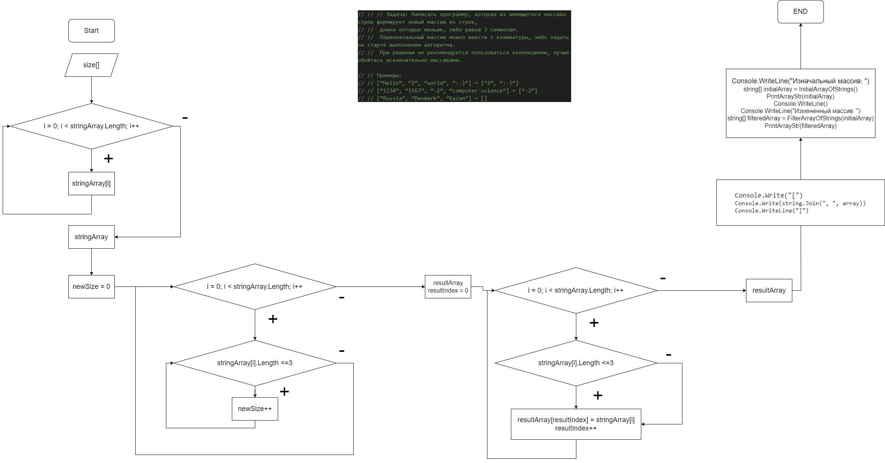

# FirstControlWork-1-
<h1> Контрольная работа №1 </h1>
<H2>Задача</H2>
 Написать программу, которая из имеющегося массива строк формирует новый массив из строк,
 длина которых меньше, либо равна 3 символам. 
  Первоначальный массив можно ввести с клавиатуры, либо задать на старте выполнения алгоритма. 
 При решении не рекомендуется пользоваться коллекциями, лучше обойтись исключительно массивами.

 Примеры:

 [“Hello”, “2”, “world”, “:-)”] → [“2”, “:-)”]

 [“1234”, “1567”, “-2”, “computer science”] → [“-2”]
 
 [“Russia”, “Denmark”, “Kazan”] → []

<h2> Решение в коде предоставлено в виде 3 методов: </h2>

1. InitialArrayOfStrings - в нем происходит создание первоначального массива, пользователя спрашивают из скольки элементов будет состоять его массив и что он хочет в него внести.
2. FilterArrayOfStrings - вводятся дополнительные переменные необходимые для решения задачи и с помощью них получаем новый массив строк, длина которого меньше либо равна 3 символам.
3. PrintArrayStr - стандартный метод для вывода массива, в нашем случае массива строк.

<h2> Блок-схема </h2>

Также доступна по ссылке в приложении draw.io - https://drive.google.com/file/d/1-H_GVRWrnme2IcZeiwTouXiFRNZ08-vZ/view (доступ предоставлен только по ссылке)
